# 🍽️ Lezzet Evi — Profesyonel Restoran & Adisyon Yönetim Sistemi

**Lezzet Evi**, **ASP.NET Core 8.0** tabanlı, modern bir restoranın tüm dijital operasyonlarını uçtan uca yönetmek için geliştirilmiş kapsamlı bir web uygulamasıdır. Proje; **N-Tier Architecture (Katmanlı Mimari)** ve **Repository Pattern** prensipleri üzerine inşa edilerek, yüksek sürdürülebilirlik ve kurumsal standartlarda kod kalitesi hedeflenmiştir.

Müşteri tarafında **akıllı sepet**, **masa bazlı sipariş** ve **dinamik menü**; yönetici tarafında ise **masa yönetimi (POS/Adisyon)**, **gelişmiş satış raporlaması** ve **tam yetkili CRUD** işlemlerini barındıran eksiksiz bir restoran otomasyon çözümüdür.

---

## 🚀 Öne Çıkan Özellikler

| Özellik | Açıklama |
| --- | --- |
| **🍽️ Masa Yönetimi (POS)** | Masaların **Boş / Dolu / Hesap Bekliyor** durumlarının renk kodlu kartlarla anlık takibi, masa bazlı hesap ve bekleme süresi kontrolü. |
| **🛒 Masaya Özel Akıllı Sepet** | Session tabanlı sepet; ürün ekleme/çıkarma/miktar güncelleme, masa seçimi ve aktif siparişe göre masa kilidleme mekanizması. |
| **📋 Detaylı Sipariş Takibi** | Her masadaki siparişlerin ayrı ayrı dökümü, ürün bazlı adet artırma/azaltma/silme, komple sipariş iptali ve hesap kapatma. |
| **📖 Dinamik Menü** | "Menüler" (Fix & Ekonomik) ve "Tekil Ürünler" sekmeleri ile kategorize edilmiş ürün katalogu. |
| **📊 Gelişmiş Raporlama** | Günlük, haftalık ve aylık satış verilerinin ürün bazlı analitik takibi. |
| **📤 Excel & PDF Export** | Satış raporlarını tek tıkla **EPPlus (Excel)** veya **iTextSharp (PDF)** formatında indirme. |
| **🛠️ Admin Paneli** | Ürün, kategori ve masa yönetimi için tam yetkili CRUD işlemleri. |
| **🔐 Güvenlik & Identity** | Microsoft Identity ile e-posta/şifre ve Google OAuth ile güvenli giriş; Admin/User rol tabanlı yetkilendirme. |
| **🌙 Dark Mode** | Koyu/açık tema geçişi (localStorage ile kalıcı tercih). |
| **📱 Responsive Tasarım** | Tüm ekran boyutlarına uyumlu, mobil öncelikli modern arayüz. |

---

## 📸 Uygulama Ekran Görüntüleri

Uygulamanın modüllerini ve işleyişini anlatan detaylı ekran görüntüleri aşağıdadır.

---

### 1️⃣ Ana Sayfa — Menüler ve Tekil Ürünler

Kullanıcının karşılaştığı ana menü ve ürün sayfaları. Müşteri (User) menü ekranında kategorize edilmiş içerikleri inceleyebilir.

| Menüler Ekranı | Tekil Ürünler Ekranı |
| :---: | :---: |
| 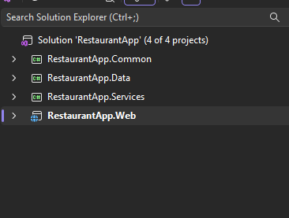 | 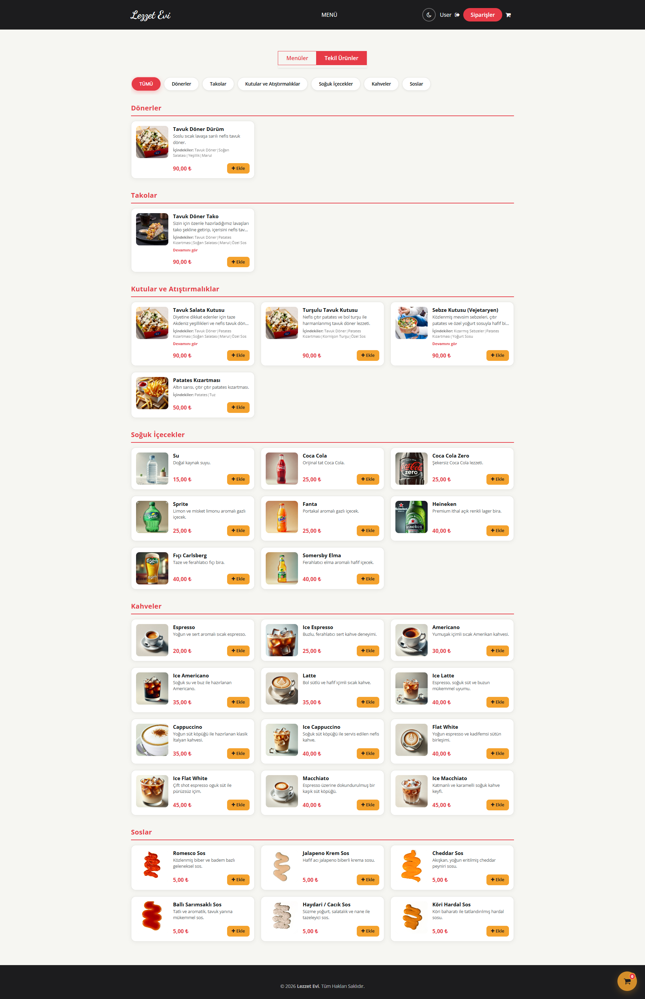 |

> **Menüler:** Kayıt olan kullanıcı (müşteri) tarafından görülen hazır paket menülerin yer aldığı ekran.  
> **Tekil Ürünler:** Tüm bireysel ürünlerin kategoriler halinde listelendiği, detaylı seçim ekranı.

---

### 2️⃣ Akıllı Sepet Sistemi (My Cart)

Kullanıcı ürünleri sepete eklediğinde sepet paneli üzerinden sipariş sürecini yönetir.

| Sadece Sepet Görünümü | Sepet ve Menü Birlikte |
| :---: | :---: |
| 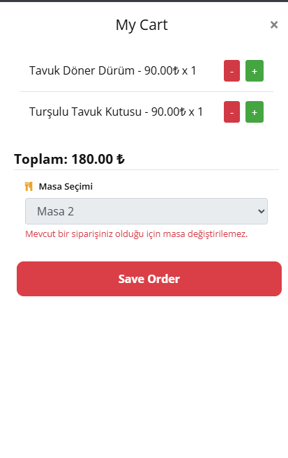 | 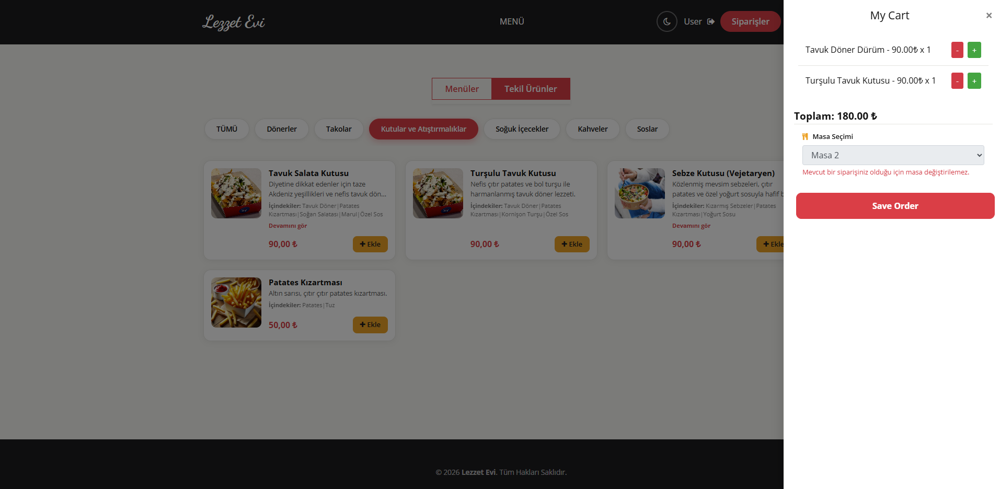 |

> Ürünler sepete eklendiğinde **"My Cart"** görünür. Masa seçimi yapılır ve tutarlar anlık hesaplanır. Tüm menü ile birlikte açık olduğunda (11.png), sağ panelde sepet detayları izlenebilir.

---

### 3️⃣ Sipariş Geçmişi Çekmecesi

Kullanıcının o anki masasında verdiği siparişlerin genel bir özetini gösteren çekmece menü.

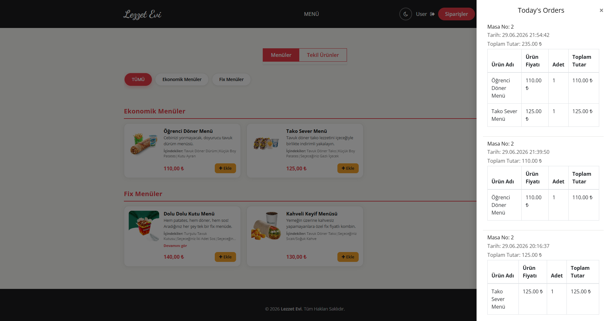

> Verilen siparişlerin menü ekranı üzerinde sağ taraftan açılarak görüntülendiği "Today's Orders" paneli. 

---

### 4️⃣ Kimlik Doğrulama — Giriş ve Kayıt Ekranları

Microsoft Identity ve Google OAuth destekli güvenli giriş ve kayıt sistemi. Kayıt işlemi tamamlandığında kullanıcıya e-posta doğrulama ekranı gösterilir.

| Giriş Yap (Login) | Kayıt Ol (Register) | E-posta Doğrulama |
| :---: | :---: | :---: |
| 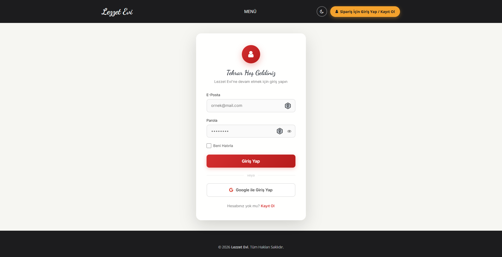 | 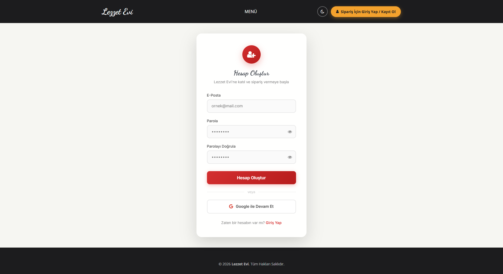 | 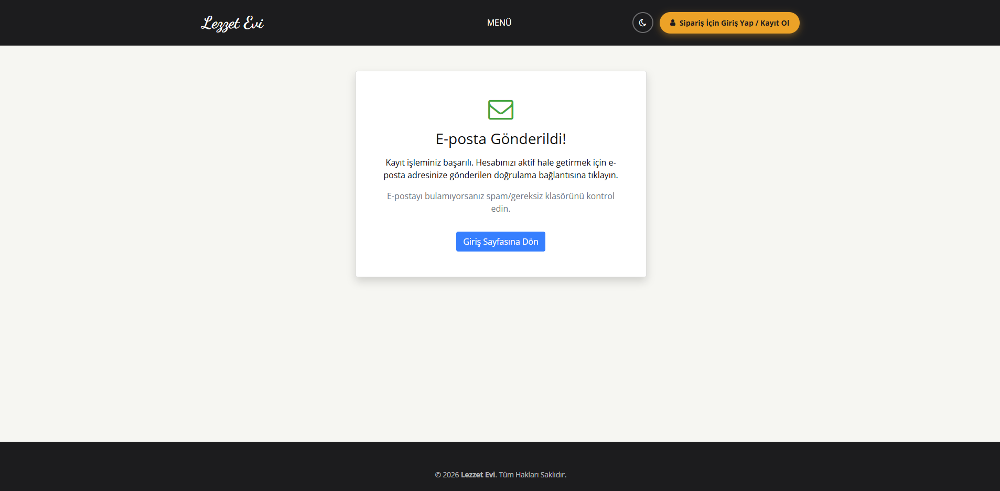 |

> Başarılı kayıt sonrası **EmailVerificationSent (9.png)** sayfasına yönlendirilir. Kullanıcı e-posta kutusuna gelen link ile hesabını doğruladığında, tekrar login olmasına gerek kalmadan otomatik olarak sisteme giriş yapmış şekilde Ana Sayfa'ya aktarılır.

---

### 5️⃣ Masa Yönetimi — POS Panosu (Admin)

Admin tarafında, tüm masaların durumunun yönetildiği ana pano.

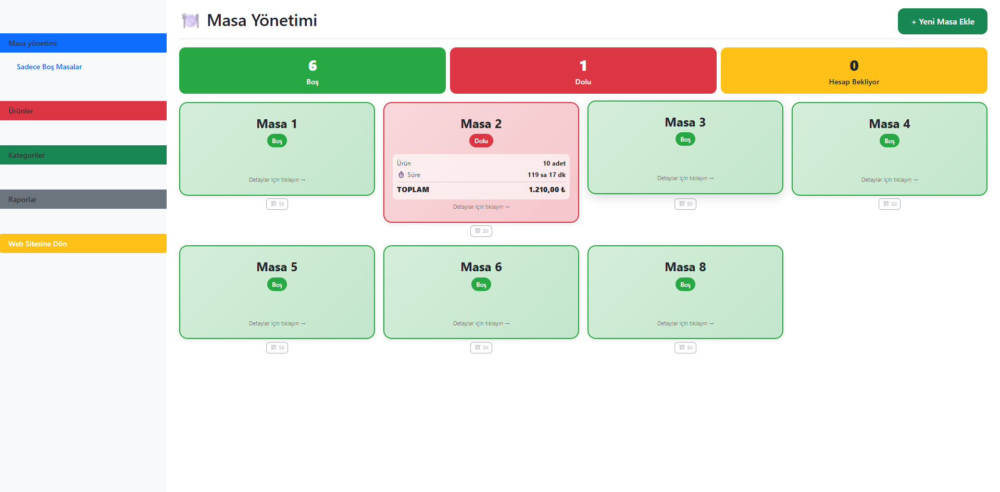

> Masaların boş, dolu ve hesap bekliyor statülerini anlık gösteren masa yönetimi ekranı.

---

### 6️⃣ Masa Detay ve Sipariş Yönetimi (Admin)

Masaların üzerine tıklandığında sipariş detaylarını gösteren görünümler. 

| Masa Üzerine Tıklayınca Açılan Detay | Masa Detayı / Çoklu Siparişler |
| :---: | :---: |
| 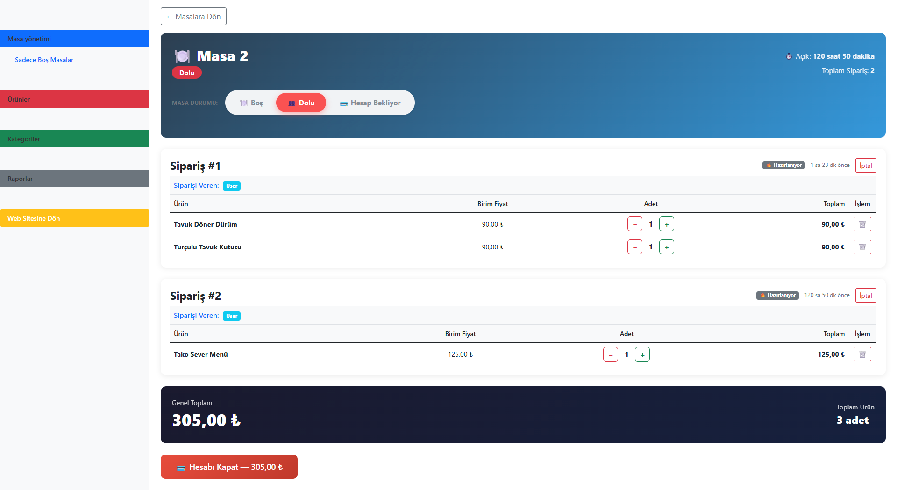 |  |

> **16.png:** Masa üzerine tıklandığında açılan ve hesap kapatma/siparişleri listeleme imkanı sunan temel masa detayı ekranı.  
> **7.png:** Masanın içerisindeki sipariş durumlarını detaylı olarak gösteren ekran.

---

### 7️⃣ Yeni Masa Ekleme (Admin)

Yeni masalar oluşturmak için kullanılan ekran.

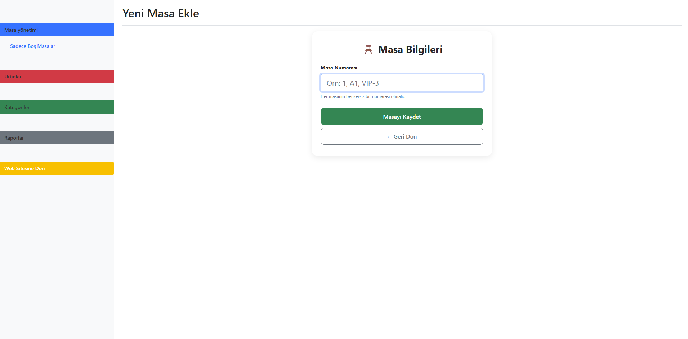

---

### 8️⃣ Ürün Yönetimi (Admin)

Admin panelindeki ürün listeleme, silme ve düzenleme ekranları.

| Tüm Ürünler Listesi | Ürün Düzenleme |
| :---: | :---: |
| 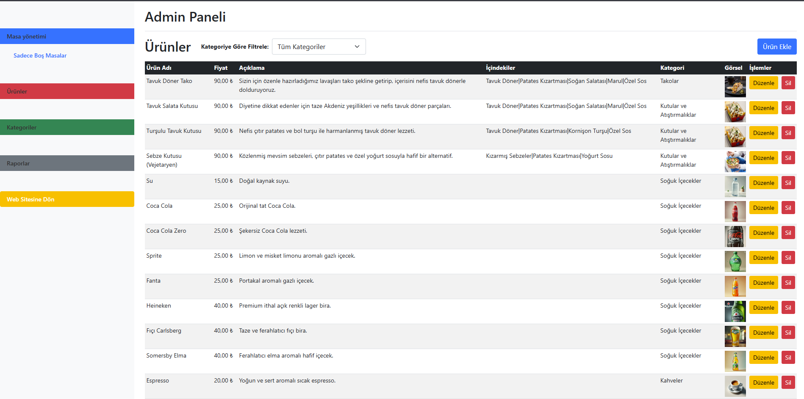 | 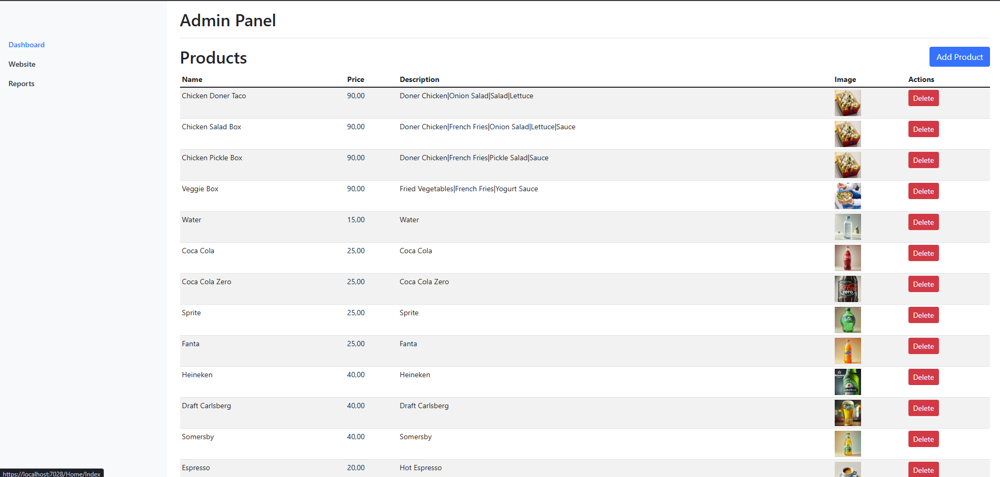 |

> **12.png:** Sistemdeki tüm ürünlerin listelendiği, "Düzenle" ve "Sil" aksiyonlarının yer aldığı tablo.  
> **6.png:** Mevcut bir ürünün isim, fiyat, açıklama ve görselinin güncellendiği düzenleme formu.

---

### 9️⃣ Kategori Yönetimi (Admin)

Ürün kategorilerinin yönetildiği alan.

| Tüm Kategoriler Listesi | Kategori Düzenleme |
| :---: | :---: |
| 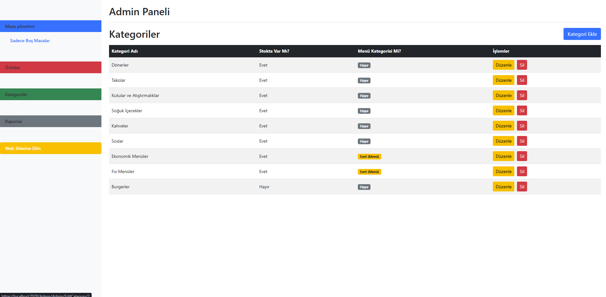 | 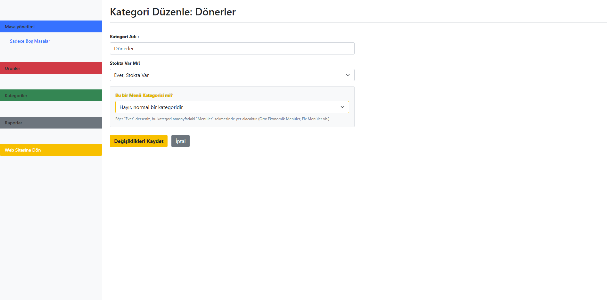 |

> **13.png:** Kategorilerin listelendiği ekran.  
> **14.png:** Kategorilerin içeriklerinin (menü kategorisi olup olmadığı vb.) düzenlendiği ekran.

---

### 🔟 Satış Raporları (Admin)

Günlük, haftalık ve aylık periyotlarla sistemdeki tüm satışların listelendiği panel.

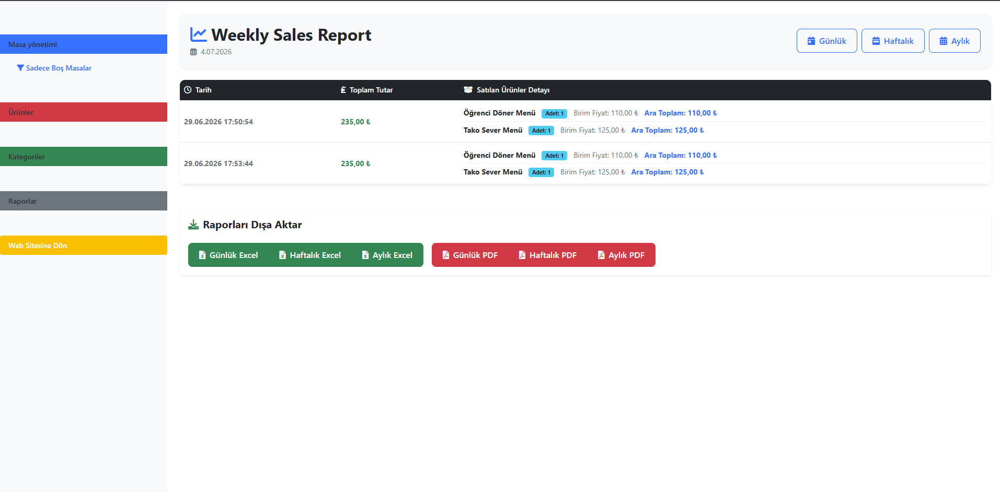

> Bu ekranda ürünlerin detaylı satışı görüntülenir ve Excel/PDF formatlarında dışarı aktarma (export) seçenekleri bulunur.

---

## 🛠️ Teknik Mimari

Proje, **Separation of Concerns (Sorumlulukların Ayrılması)** ilkesine uygun olarak 4 temel katman üzerine kurgulanmıştır:

- **Sunum:** `RestaurantApp.Web` (MVC katmanı)
- **İş Mantığı:** `RestaurantApp.Services` (Repository Pattern)
- **Veri Erişim:** `RestaurantApp.Data` (Entity Framework Core)
- **Ortak:** `RestaurantApp.Common` (Entity sınıfları, DTO'lar)

---

## 📦 Kullanılan Teknolojiler

- **.NET 8.0 (ASP.NET Core MVC)**
- **MS SQL Server & EF Core**
- **Microsoft Identity**
- **EPPlus & iTextSharp**
- **Bootstrap 5, JS, CSS3, HTML5**

---

## 🔧 Kurulum ve Çalıştırma

> [!IMPORTANT]
> `appsettings.json` dosyası **güvenlik nedeniyle `.gitignore`'a eklenmiştir** ve Git'e gönderilmez. İçerdiği veritabanı bağlantısı, Google OAuth anahtarları ve SMTP şifresi gibi hassas bilgilerin kaynak kodunuza karışmaması için bu yaklaşım kullanılmıştır.

### Adım 1 — Projeyi Klonlayın
```bash
git clone https://github.com/bariscoskun441/RestaurantApp.git
```

### Adım 2 — Yapılandırma Dosyasını Oluşturun
```bash
# Windows (PowerShell)
Copy-Item "RestaurantApp.Web\appsettings.example.json" "RestaurantApp.Web\appsettings.json"

# Linux / macOS
cp RestaurantApp.Web/appsettings.example.json RestaurantApp.Web/appsettings.json
```

Oluşturduğunuz `appsettings.json` dosyasını kendi bilgilerinize göre güncelleyin.

### Adım 3 — Veritabanını Oluşturun ve Çalıştırın
Package Manager Console üzerinden:
```bash
Update-Database
```
```bash
dotnet run --project RestaurantApp.Web
```

---

## 📫 İletişim

- **LinkedIn:** [linkedin.com/in/bariscoskun441](https://www.linkedin.com/in/bariscoskun441)
- **E-Posta:** bariscoskun441@gmail.com